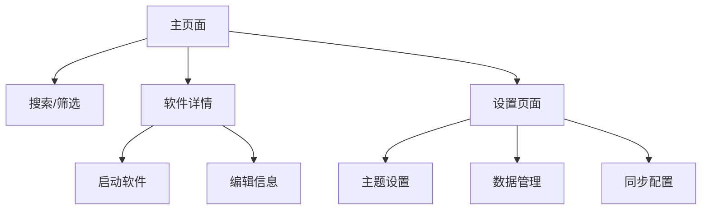

## 1. 产品概述
ToolCollectionManager是一个基于.NET 10的WPF桌面应用程序，用于展示和管理用户收集的工具软件集合。该应用帮助用户整理、分类和快速启动各种实用工具软件，提供现代化的界面设计和流畅的用户体验。

目标用户为需要管理和快速访问大量工具软件的个人用户和技术爱好者，通过集中化管理提升工作效率。

## 2. 核心功能

### 2.1 用户角色
| 角色 | 注册方式 | 核心权限 |
|------|----------|----------|
| 普通用户 | 本地使用，无需注册 | 浏览、搜索、启动软件、添加收藏 |
| 高级用户 | 可选云端账户 | 云端同步、数据导入导出、高级筛选 |

### 2.2 功能模块
应用包含以下核心页面：
1. **主页面**：软件列表展示、搜索栏、分类筛选、快速启动
2. **详情页面**：软件详细信息、截图展示、评分评论、编辑功能
3. **设置页面**：主题设置、数据管理、同步配置、语言选择

### 2.3 页面详情
| 页面名称 | 模块名称 | 功能描述 |
|----------|----------|----------|
| 主页面 | 软件列表 | 网格/列表视图切换、图标展示、名称显示、分类标签 |
| 主页面 | 搜索功能 | 实时搜索、模糊匹配、搜索结果高亮 |
| 主页面 | 分类筛选 | 侧边栏分类树、多选筛选、分类统计 |
| 主页面 | 快速启动 | 双击启动、右键菜单、批量启动 |
| 详情页面 | 基本信息 | 软件名称、图标、版本、开发商、功能简介 |
| 详情页面 | 截图展示 | 多图轮播、缩略图预览、全屏查看 |
| 详情页面 | 评分评论 | 五星评分、文字评论、点赞功能 |
| 详情页面 | 编辑功能 | 信息编辑、图标更换、截图上传、分类调整 |
| 设置页面 | 主题设置 | 颜色方案选择、深色模式、自定义主题 |
| 设置页面 | 数据管理 | 备份还原、导入导出、清理缓存 |
| 设置页面 | 同步配置 | 云端账户绑定、同步频率设置、冲突处理 |
| 设置页面 | 语言选择 | 多语言切换、界面语言包管理 |

## 3. 核心流程
用户主要操作流程：

**普通用户流程**：
1. 打开应用 → 浏览软件列表 → 使用搜索或筛选 → 查看软件详情 → 启动软件

**软件管理流程**：
1. 添加软件 → 填写基本信息 → 上传图标截图 → 设置分类标签 → 保存到收藏

**数据同步流程**（高级用户）：
1. 登录账户 → 选择同步方式 → 上传本地数据 → 在其他设备下载同步

## 4. 用户界面设计

### 4.1 设计风格
- **设计语言**：采用Fluent Design设计语言，结合Material Design元素
- **主色调**：深蓝色（#0078D4）作为主色，浅灰色（#F3F2F1）作为背景
- **按钮样式**：圆角矩形，悬浮效果，点击动画
- **字体方案**：Segoe UI为主字体，大小层级：标题18px、正文14px、小字12px
- **图标风格**：线性图标，统一线条粗细，支持深色/浅色主题切换

### 4.2 页面设计概览
| 页面名称 | 模块名称 | UI元素 |
|----------|----------|--------|
| 主页面 | 顶部导航 | 搜索框（圆角白色背景）、分类下拉菜单、视图切换按钮 |
| 主页面 | 软件网格 | 卡片式布局（白色卡片+阴影）、图标圆形显示、分类标签彩色 |
| 主页面 | 侧边栏 | 分类树形结构、统计数字显示、折叠展开动画 |
| 详情页面 | 头部区域 | 大图标展示、软件名称、评分星级、操作按钮组 |
| 详情页面 | 内容区域 | 标签页切换、截图画廊、信息表格、评论区 |
| 设置页面 | 分类卡片 | 设置项分组、开关控件、颜色选择器、预览效果 |

### 4.3 响应式设计
- **桌面优先**：默认适配1920×1080分辨率
- **响应式布局**：支持窗口大小调整，最小尺寸1280×720
- **断点设计**：>1600px（大屏幕）、1200-1600px（标准）、<1200px（小屏幕）
- **触摸优化**：按钮最小44px点击区域，支持触摸滑动操作

### 4.4 动画效果
- **页面切换**：淡入淡出动画，持续时间300ms
- **卡片悬浮**：缩放效果（1.02倍），阴影加深
- **加载动画**：骨架屏占位，渐进式内容显示
- **交互动画**：按钮点击波纹效果，平滑过渡