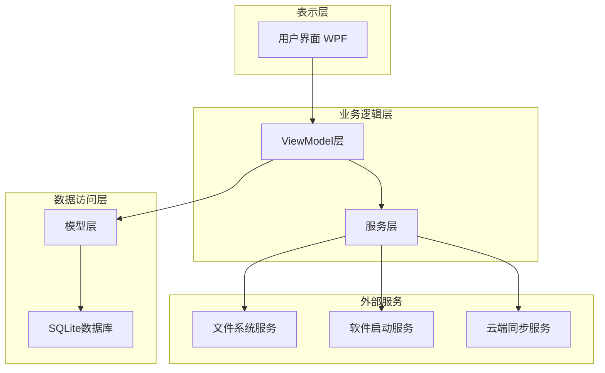
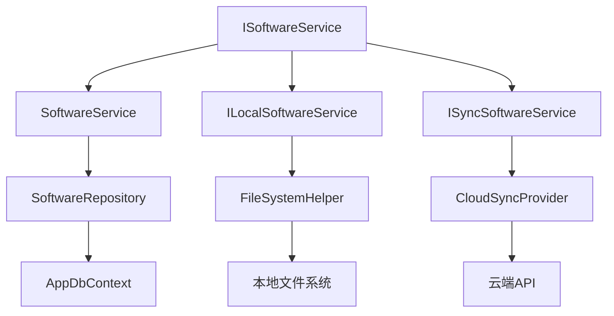
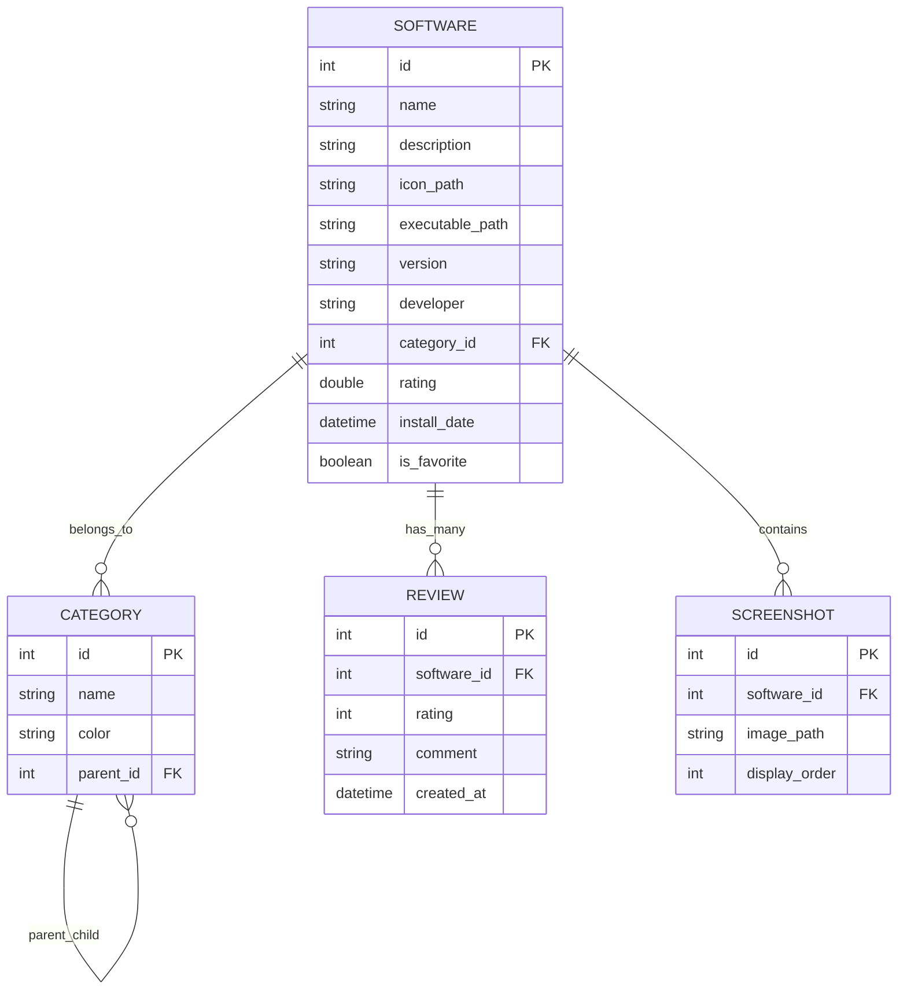

## 1. 架构设计



## 2. 技术描述

- **前端框架**：WPF (.NET 10) + XAML + MVVM CommunityToolkit.Mvvm
- **数据存储**：SQLite + Entity Framework Core
- **依赖注入**：Microsoft.Extensions.DependencyInjection
- **UI控件库**：MaterialDesignInXamlToolkit
- **图片处理**：System.Drawing.Common
- **序列化**：System.Text.Json
- **单元测试**：xUnit + Moq
- **打包工具**：Microsoft Visual Studio Installer Projects

## 3. 路由定义

| 路由 | 目的 |
|------|------|
| /MainWindow | 主窗口，软件列表展示和主要操作 |
| /Views/SoftwareDetailView | 软件详情页面，显示详细信息和编辑功能 |
| /Views/SettingsView | 设置页面，主题、数据管理、同步配置 |
| /Views/AddSoftwareView | 添加软件对话框 |
| /Views/CategoryManageView | 分类管理页面 |

## 4. 核心类定义

### 4.1 模型类
```csharp
public class SoftwareItem
{
    public int Id { get; set; }
    public string Name { get; set; }
    public string Description { get; set; }
    public string IconPath { get; set; }
    public string ExecutablePath { get; set; }
    public string Version { get; set; }
    public string Developer { get; set; }
    public int CategoryId { get; set; }
    public Category Category { get; set; }
    public List<string> Screenshots { get; set; }
    public double Rating { get; set; }
    public List<Review> Reviews { get; set; }
    public DateTime InstallDate { get; set; }
    public bool IsFavorite { get; set; }
}

public class Category
{
    public int Id { get; set; }
    public string Name { get; set; }
    public string Color { get; set; }
    public int? ParentId { get; set; }
    public Category Parent { get; set; }
    public List<Category> Children { get; set; }
}

public class Review
{
    public int Id { get; set; }
    public int SoftwareId { get; set; }
    public int Rating { get; set; }
    public string Comment { get; set; }
    public DateTime CreatedAt { get; set; }
}
```

### 4.2 ViewModel类
```csharp
public class MainViewModel : ObservableObject
{
    private readonly ISoftwareService _softwareService;
    private readonly IDialogService _dialogService;
    
    public ObservableCollection<SoftwareItem> SoftwareItems { get; set; }
    public string SearchText { get; set; }
    public Category SelectedCategory { get; set; }
    
    public IAsyncRelayCommand LaunchSoftwareCommand { get; }
    public IAsyncRelayCommand AddSoftwareCommand { get; }
    public IRelayCommand ViewDetailsCommand { get; }
}

public class SoftwareDetailViewModel : ObservableObject
{
    private readonly ISoftwareService _softwareService;
    
    public SoftwareItem CurrentSoftware { get; set; }
    public ObservableCollection<Review> Reviews { get; set; }
    
    public IAsyncRelayCommand SaveChangesCommand { get; }
    public IAsyncRelayCommand LaunchSoftwareCommand { get; }
    public IRelayCommand AddReviewCommand { get; }
}
```

## 5. 服务层架构



## 6. 数据模型

### 6.1 数据库关系图


### 6.2 数据定义语言

```sql
-- 软件表
CREATE TABLE Software (
    Id INTEGER PRIMARY KEY AUTOINCREMENT,
    Name TEXT NOT NULL,
    Description TEXT,
    IconPath TEXT,
    ExecutablePath TEXT NOT NULL,
    Version TEXT,
    Developer TEXT,
    CategoryId INTEGER,
    Rating REAL DEFAULT 0,
    InstallDate TEXT DEFAULT CURRENT_TIMESTAMP,
    IsFavorite INTEGER DEFAULT 0,
    FOREIGN KEY (CategoryId) REFERENCES Category(Id)
);

-- 分类表
CREATE TABLE Category (
    Id INTEGER PRIMARY KEY AUTOINCREMENT,
    Name TEXT NOT NULL,
    Color TEXT DEFAULT '#0078D4',
    ParentId INTEGER,
    FOREIGN KEY (ParentId) REFERENCES Category(Id)
);

-- 评论表
CREATE TABLE Review (
    Id INTEGER PRIMARY KEY AUTOINCREMENT,
    SoftwareId INTEGER NOT NULL,
    Rating INTEGER CHECK (Rating >= 1 AND Rating <= 5),
    Comment TEXT,
    CreatedAt TEXT DEFAULT CURRENT_TIMESTAMP,
    FOREIGN KEY (SoftwareId) REFERENCES Software(Id)
);

-- 截图表
CREATE TABLE Screenshot (
    Id INTEGER PRIMARY KEY AUTOINCREMENT,
    SoftwareId INTEGER NOT NULL,
    ImagePath TEXT NOT NULL,
    DisplayOrder INTEGER DEFAULT 0,
    FOREIGN KEY (SoftwareId) REFERENCES Software(Id)
);

-- 创建索引
CREATE INDEX idx_software_category ON Software(CategoryId);
CREATE INDEX idx_software_name ON Software(Name);
CREATE INDEX idx_review_software ON Review(SoftwareId);
CREATE INDEX idx_screenshot_software ON Screenshot(SoftwareId);

-- 初始化数据
INSERT INTO Category (Name, Color) VALUES 
('开发工具', '#0078D4'),
('系统工具', '#107C10'),
('媒体工具', '#FF8C00'),
('办公工具', '#8E8CD8'),
('网络工具', '#00BCF2');
```

## 7. 关键技术实现

### 7.1 MVVM模式实现
- 使用CommunityToolkit.Mvvm框架简化MVVM实现
- ObservableObject基类提供属性变更通知
- RelayCommand和AsyncRelayCommand处理命令绑定
- WeakReferenceMessenger实现ViewModel间通信

### 7.2 数据持久化
- Entity Framework Core作为ORM框架
- SQLite本地数据库存储结构化数据
- JSON文件存储用户偏好设置
- 图片文件存储在本地文件夹中

### 7.3 软件启动机制
- 使用Process.Start()启动外部程序
- 路径验证和异常处理
- 管理员权限请求（如需要）
- 启动历史记录跟踪

### 7.4 主题系统
- ResourceDictionary定义颜色和样式
- 动态主题切换功能
- 自定义颜色方案支持
- 深色/浅色模式自动切换