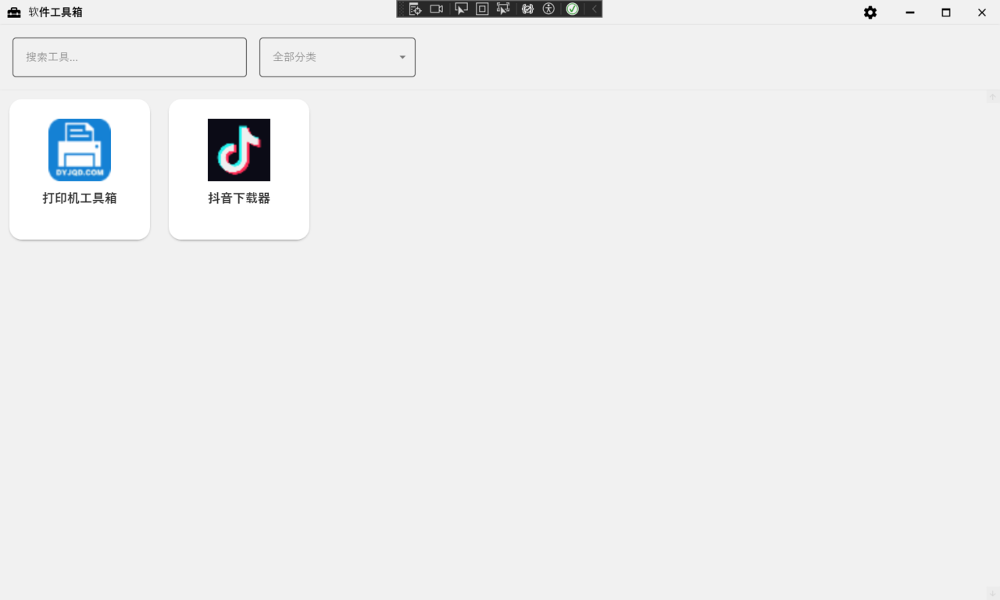

# 好用软件收集器

## 1. 产品概述
ToolCollectionManager是一个基于.NET 10的WPF桌面应用程序，
用于展示和管理用户收集的工具软件集合。该应用帮助用户整理、分类和快速启动各种实用工具软件，提供现代化的界面设计和流畅的用户体验。
目标用户为需要管理和快速访问大量工具软件的个人用户和技术爱好者，通过集中化管理提升工作效率。

PS:日常收集到很多得绿色软件，无法统一管理，因此制作了一个收集器
